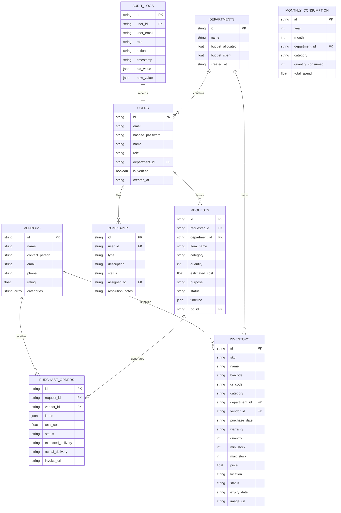
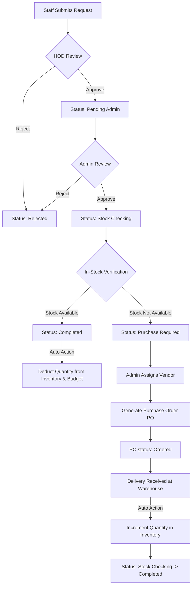

# Smart Inventory & Procurement Management System (SIPMS)

SIPMS is an enterprise-grade ERP web application designed to digitize and automate inventory, requests, procurement, complaints, and budget tracking for educational institutions (schools and colleges). 

It features a premium visual layout (glassmorphic styling, ambient background animations, and custom Recharts visualization) and supports role-based workflows (RBAC) across **5 distinct roles**: Administrator, Staff, HOD, Principal, and Management.

---

## Technical Stack

* **Frontend:** React.js, Tailwind CSS (v4), Framer Motion, React Router, Axios, TanStack Query, Recharts, Lucide Icons.
* **Backend:** Python FastAPI, Pydantic, JWT Auth (Access & Refresh), Passlib, Cryptography.
* **Database:** MongoDB (using Motor & PyMongo drivers) with an **automatic local JSON-file fallback** to ensure instant out-of-the-box local execution if no MongoDB database is running.
* **Reports:** CSV, Excel (using OpenPyXL), and PDF (using ReportLab).
* **AI Engine:** Built-in exponential smoothing, moving averages, and linear trend regression algorithms for demand forecasting.

---

## System Architecture & Flows

### 1. Database ER Diagram
This diagram outlines the relational structure of our Power BI-ready MongoDB collections.



---

### 2. Request Approval & Automated Procurement Workflow
This diagram illustrates the request lifecycle, detailing the HOD review, Admin check, and automatic stock updates.



---

### 3. Authentication & RBAC Session Flow
The authorization lifecycle managing Access & Refresh tokens.

```mermaid
sequenceDiagram
    participant User as React App
    participant API as FastAPI Backend
    participant DB as Database / Fallback

    User->>API: Login credentials (Email, Password)
    API->>DB: Fetch user by email
    DB->>API: User record (verify hashed password)
    API->>API: Generate Access (60 min) & Refresh (30 days) Tokens
    API->>User: TokenResponse (Tokens + User Object)
    Note over User, API: Access Token attached to Header common['Authorization']
    
    rect rgb(20, 20, 40)
        Note over User: Access Token expires (FastAPI returns 401)
        User->>API: POST /api/auth/refresh (send Refresh Token)
        API->>API: Decode & verify Refresh Token
        API->>User: Return new Access & Refresh tokens
    end
```



---

## Folder Directory Structure

```
place1/
├── README.md               <-- Main documentation
├── local_db.json           <-- Fallback JSON Database (auto-generated)
├── backend/                <-- FastAPI Python Project
│   ├── requirements.txt    <-- Dependencies list
│   ├── verify_system.py    <-- Backend operational testing suite
│   └── app/
│       ├── main.py         <-- Entry point uvicorn app
│       ├── core/           <-- Configuration & security settings
│       ├── db/             <-- DB engine fallback & seeding logic
│       ├── models/         <-- Pydantic response models
│       └── routes/         <-- API controller endpoints
└── frontend/               <-- React JS Vite Client
    ├── index.html          <-- SEO details html
    ├── vite.config.js      <-- Vite & Tailwind v4 compile hook
    ├── package.json        <-- NPM frontend packages
    └── src/
        ├── main.jsx        <-- React DOM anchor
        ├── App.jsx         <-- Routes registry and auth guards
        ├── index.css       <-- CSS modules & glassmorphic styles
        ├── components/     <-- Layout shell, sidebar, header
        ├── context/        <-- Auth & Theme Context providers
        └── pages/          <-- 5-Role pages (Dashboard, Inventory...)
```

---

## API Catalog Documentation

### 1. Authentication
* `POST /api/auth/register` - Registers a user.
* `POST /api/auth/login` - Authenticates credentials and returns JWT tokens.
* `POST /api/auth/refresh` - Swaps an active refresh token for a new access token.
* `GET /api/auth/profile` - Fetches active profile metadata.
* `PUT /api/auth/profile` - Updates name, email, or credentials.
* `POST /api/auth/forgot-password` - Requests reset code.
* `POST /api/auth/reset-password` - Resets password with valid token.

### 2. Inventory
* `GET /api/inventory` - Queries paginated list (with search, category, status, and department filters).
* `POST /api/inventory` - Creates a new asset (Admin only).
* `PUT /api/inventory/{id}` - Updates quantities or values (Admin only).
* `DELETE /api/inventory/{id}` - Deletes an asset (Admin only).

### 3. Requests
* `GET /api/requests` - Lists requests (Staff see only theirs; HODs see their department's; Admin/Principal see all).
* `POST /api/requests` - Submits a request (Staff).
* `PUT /api/requests/{id}/status` - Advances the request approval stage (HOD, Admin, Principal).

### 4. Purchases & Vendors
* `GET /api/purchases/vendors` - Lists vendor directories.
* `POST /api/purchases/vendors` - Creates a vendor (Admin only).
* `POST /api/purchases/vendors/{id}/rate` - Rates a supplier's quality (Admin, HOD).
* `GET /api/purchases/orders` - Retrieves Purchase Orders.
* `POST /api/purchases/orders` - Generates a Purchase Order (Admin).
* `PUT /api/purchases/orders/{id}/status` - Updates PO status (Draft $\rightarrow$ Sent $\rightarrow$ Received).

### 5. Complaints
* `GET /api/complaints` - Lists complaint tickets.
* `POST /api/complaints` - Logs a new complaint (Staff).
* `PUT /api/complaints/{id}` - Updates ticket statuses and resolution notes (Admin).

### 6. Analytics & AI Insights
* `GET /api/analytics/dashboard` - Fetches dashboard numbers and charting matrices.
* `GET /api/analytics/metrics` - Aggregates supplier ranks and stage speeds.
* `GET /api/ai/insights` - Calculates demand forecasts, reorder sugestions, and budget limits.

### 7. Reports & Audit
* `GET /api/reports/export/csv/{type}` - Streams tabular records as CSV.
* `GET /api/reports/export/excel/{type}` - Generates styled Excel spreadsheets.
* `GET /api/reports/export/pdf/{type}` - Generates formatted PDF tables.
* `GET /api/audit/logs` - Retrieves transaction logs (Admin only).

---

## Installation & Running Locally

### Prerequisites
* Python 3.10+
* Node.js 18+

### Step 1: Initialize Backend Server
1. Navigate to the backend directory:
   ```bash
   cd backend
   ```
2. Create and activate a Python virtual environment (optional but recommended):
   ```bash
   python -m venv venv
   # On Windows:
   venv\Scripts\activate
   # On MacOS/Linux:
   source venv/bin/activate
   ```
3. Install Python dependencies:
   ```bash
   pip install -r requirements.txt
   ```
4. Start the FastAPI server:
   ```bash
   python app/main.py
   ```
   The backend will run on `http://localhost:8000`. It will automatically generate `local_db.json` and seed initial records.

### Step 2: Initialize Frontend Client
1. Open a new terminal and navigate to the frontend directory:
   ```bash
   cd frontend
   ```
2. Install npm dependencies:
   ```bash
   npm install
   ```
3. Launch the Vite development server:
   ```bash
   npm run dev
   ```
   The client will open on `http://localhost:5173`.

---

## Seed Accounts for Testing

Use the quick-login buttons on the Login page, or enter the credentials manually:

| Role | Email | Password |
|---|---|---|
| **Administrator** | `admin@sipms.edu` | `admin123` |
| **Staff (Computer Science)** | `staff.cs@sipms.edu` | `staff123` |
| **HOD (Computer Science)** | `hod.cs@sipms.edu` | `hod123` |
| **Principal** | `principal@sipms.edu` | `principal123` |
| **Management** | `management@sipms.edu` | `management123` |
